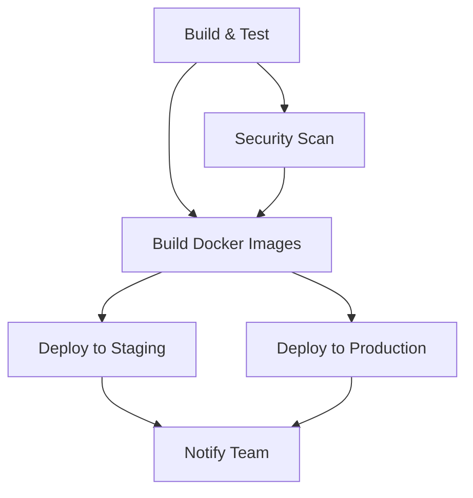

# CI/CD Pipeline Documentation

## Overview

This document describes the complete CI/CD pipeline for the Book Store & Rental Microservices Platform using GitHub Actions.

## Pipeline Architecture

### 🔄 Workflows Overview

| Workflow            | Trigger                   | Purpose                        | Duration   |
| ------------------- | ------------------------- | ------------------------------ | ---------- |
| `ci-cd.yml`         | Push to main/develop, PR  | Full CI/CD pipeline            | ~15-20 min |
| `pr-validation.yml` | Pull requests             | Code validation                | ~8-10 min  |
| `security-scan.yml` | Schedule (weekly), manual | Security & dependency scanning | ~5-8 min   |
| `release.yml`       | Manual trigger            | Create releases & tags         | ~10-12 min |

## 🚀 Main CI/CD Pipeline (`ci-cd.yml`)

### Jobs Flow



### Job Details

#### 1. Build and Test

- **Duration**: ~8-10 minutes
- **Services**: PostgreSQL, Redis, RabbitMQ
- **Steps**:
  - Checkout code
  - Setup JDK 17
  - Cache Maven dependencies
  - Compile all modules
  - Run unit tests
  - Run integration tests
  - SonarQube analysis (main branch only)
  - Package applications
  - Upload artifacts

#### 2. Security Scan

- **Duration**: ~3-5 minutes
- **Dependencies**: Build and Test job
- **Steps**:
  - OWASP Dependency Check
  - Vulnerability assessment
  - Upload security reports

#### 3. Build Docker Images

- **Duration**: ~5-8 minutes (parallel execution)
- **Strategy**: Matrix build for all 9 services
- **Features**:
  - Multi-platform builds (AMD64, ARM64)
  - Layer caching
  - Push to GitHub Container Registry
  - Semantic versioning

#### 4. Deploy to Staging

- **Trigger**: Push to `develop` branch
- **Environment**: `staging`
- **Features**:
  - AWS ECS deployment
  - Automatic service updates
  - Smoke tests
  - Health checks

#### 5. Deploy to Production

- **Trigger**: Push to `main` branch
- **Environment**: `production`
- **Features**:
  - Blue-green deployment
  - Manual approval required
  - Comprehensive health checks
  - Automatic rollback on failure

## 🔍 Pull Request Validation (`pr-validation.yml`)

### Purpose

Validates code changes before merging to prevent breaking the main pipeline.

### Validation Steps

1. **Code Quality Checks**

   - Code formatting (Spotless)
   - Static analysis (SpotBugs, Checkstyle)
   - Compilation verification

2. **Testing**

   - Unit tests execution
   - Test coverage validation

3. **Security**

   - Basic vulnerability scan
   - Dependency security check

4. **Docker Validation**

   - Test Docker builds for modified services
   - Ensure containers can be built successfully

5. **PR Comments**
   - Automatic status updates
   - Build results summary

## 🛡️ Security Scanning (`security-scan.yml`)

### Schedule

- **Automatic**: Every Monday at 9 AM UTC
- **Manual**: On-demand via workflow dispatch

### Security Checks

1. **OWASP Dependency Check**

   - CVE vulnerability scanning
   - Severity threshold: High (CVSS ≥ 7)
   - Generate HTML reports

2. **Snyk Integration**

   - Real-time vulnerability database
   - Upload results to GitHub Security tab
   - Integration with GitHub Advanced Security

3. **Dependency Updates**
   - Check for outdated dependencies
   - Generate update reports
   - Create automated PRs for updates

### Alerting

- **High Severity**: Create GitHub issues
- **Medium Severity**: Weekly summary
- **Dependencies**: Automated update PRs

## 🏷️ Release Management (`release.yml`)

### Release Process

1. **Manual Trigger**: Specify version and release notes
2. **Version Validation**: Semantic versioning check
3. **Build & Test**: Full pipeline execution
4. **Docker Images**: Tagged with version number
5. **Git Tagging**: Create annotated tags
6. **GitHub Release**: Generate release with changelog
7. **Notifications**: Slack alerts to team

### Version Strategy

- **Format**: Semantic versioning (X.Y.Z)
- **Branching**: Releases from `main` branch only
- **Tagging**: `v1.0.0` format
- **Docker Tags**: Version + `latest`

## 🏗️ Infrastructure Requirements

### GitHub Secrets

#### Common Secrets

```bash
# GitHub Container Registry (automatically available)
GITHUB_TOKEN

# Code Quality
SONAR_TOKEN

# Notifications
SLACK_WEBHOOK

# Security Scanning
SNYK_TOKEN
```

#### Staging Environment

```bash
AWS_ACCESS_KEY_ID_STAGING
AWS_SECRET_ACCESS_KEY_STAGING
AWS_REGION
DB_PASSWORD_STAGING
REDIS_PASSWORD_STAGING
RABBITMQ_PASSWORD_STAGING
```

#### Production Environment

```bash
AWS_ACCESS_KEY_ID_PROD
AWS_SECRET_ACCESS_KEY_PROD
DB_PASSWORD_PROD
REDIS_PASSWORD_PROD
RABBITMQ_PASSWORD_PROD
DATADOG_API_KEY
NEW_RELIC_LICENSE_KEY
```

### AWS Infrastructure

#### Staging

- **ECS Cluster**: `bookstore-staging`
- **VPC**: Dedicated staging VPC
- **RDS**: PostgreSQL (single instance)
- **ElastiCache**: Redis (single node)
- **Load Balancer**: Application Load Balancer

#### Production

- **ECS Cluster**: `bookstore-production`
- **VPC**: Production VPC with private subnets
- **RDS**: PostgreSQL with read replicas
- **ElastiCache**: Redis cluster mode
- **Load Balancer**: ALB with SSL termination
- **CDN**: CloudFront distribution

## 🔧 Local Development Integration

### Pre-commit Hooks

```bash
# Install pre-commit hooks
npm install -g @commitlint/cli @commitlint/config-conventional
echo "module.exports = {extends: ['@commitlint/config-conventional']}" > commitlint.config.js

# Setup git hooks
echo "#!/bin/sh\nnpx --no-install commitlint --edit \$1" > .git/hooks/commit-msg
chmod +x .git/hooks/commit-msg
```

### Testing CI/CD Locally

#### Act (GitHub Actions Local Runner)

```bash
# Install act
brew install act

# Run workflow locally
act -j build-and-test
act -j security-scan
```

#### Docker Compose for Testing

```bash
# Test infrastructure locally
docker-compose up -d
./build.sh
```

## 📊 Monitoring and Observability

### Pipeline Metrics

- **Build Success Rate**: Target > 95%
- **Build Duration**: Target < 20 minutes
- **Test Coverage**: Target > 80%
- **Security Scan**: Zero high-severity vulnerabilities

### Dashboards

- **GitHub Actions**: Built-in workflow insights
- **SonarQube**: Code quality metrics
- **Snyk**: Security vulnerability trends
- **AWS CloudWatch**: Infrastructure metrics

### Alerts and Notifications

#### Slack Notifications

- **Success**: Release notifications
- **Failure**: Build failures, deployment issues
- **Security**: High-severity vulnerabilities

#### Email Notifications

- **GitHub**: Failed workflows, security alerts
- **AWS**: Infrastructure issues

## 🚨 Troubleshooting

### Common Issues

#### Build Failures

```bash
# Check Maven dependencies
./mvnw dependency:tree

# Verify Docker builds
docker build -t test-service ./service-name/

# Check test failures
./mvnw test -Dtest=FailingTestClass
```

#### Deployment Issues

```bash
# Check ECS service status
aws ecs describe-services --cluster bookstore-staging --services user-service

# Check application logs
aws logs get-log-events --log-group-name /ecs/bookstore-staging/user-service
```

#### Security Scan Failures

```bash
# Run OWASP locally
./mvnw org.owasp:dependency-check-maven:check

# Check for vulnerabilities
./mvnw verify -Powasp-dependency-check
```

### Recovery Procedures

#### Rollback Deployment

```bash
# Automatic rollback (configured in pipeline)
# Manual rollback to previous version
aws ecs update-service \
  --cluster bookstore-production \
  --service user-service \
  --task-definition bookstore-prod-user-service:PREVIOUS
```

#### Pipeline Recovery

1. Check GitHub Actions logs
2. Identify root cause
3. Fix issue in code/configuration
4. Re-run failed jobs or entire workflow
5. Monitor subsequent builds

## 📈 Continuous Improvement

### Optimization Opportunities

1. **Parallel Execution**: Increase job parallelism
2. **Caching**: Improve cache hit rates
3. **Test Optimization**: Reduce test execution time
4. **Resource Allocation**: Right-size runners

### Future Enhancements

1. **GitOps**: Implement ArgoCD for deployment
2. **Progressive Delivery**: Canary deployments
3. **Chaos Engineering**: Automated resilience testing
4. **Performance Testing**: Automated load testing

This CI/CD pipeline provides a robust, secure, and automated path from code commit to production deployment while maintaining high quality and security standards.
